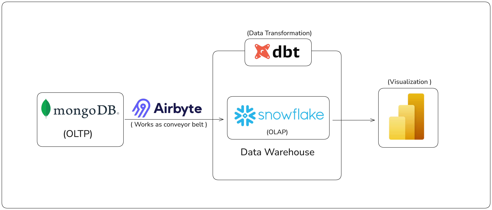

# Real-Time Insurance Claims Data Pipeline


---

## 📌 Project Overview
This project demonstrates a **beginner-friendly real-time data pipeline** for **insurance claims data**.  
We simulate real-time insurance customer and claim data, transform it using **dbt**, and finally visualize insights with **Power BI**.

This pipeline gives you a **clear blueprint of how modern data engineering projects work**, without being overwhelming, making it ideal for beginners.



---

## ⚡ Tech Stack
- **Python** → Data simulation and generation  
- **PostgreSQL** → Data Warehouse  
- **dbt** → SQL-based data transformations  
- **Power BI** → Data visualization  

---

## ✅ Key Features
- Generate **realistic insurance customers and claims data**  
- Clean and transform raw data with **dbt**  
- Build **Visualizations** in Power BI  
- Beginner-friendly, hands-on, step-by-step pipeline  

---

## 📂 Repository Structure

```text
insurance-claims-pipeline/
├── data-generator/                        # Python data generator
│   ├── generator.py
├── ins_dbt/                               # dbt project
│   └── models/
│   │   ├── claims_summary.sql
│   │   ├── stg_claims.sql
│   │   ├── source.yml
├── README.md
└── workflow.png
```

---

## 🚀 Getting Started

1. **Clone this repo and install dependencies:**
```bash
git clone https://github.com/yourusername/insurance-claims-pipeline.git
cd insurance-claims-pipeline
pip install -r requirements.txt
```

2. **Set up your database:**
   - Install PostgreSQL or use cloud database
   - Update connection details in `data-generator/ins_dbt/profiles.yml`

3. **Run Python script to generate sample insurance data:**
```bash
python data-generator/generator.py
```

4. **Initialize dbt project and run transformations:**
```bash
cd data-generator/ins_dbt
dbt run
```

5. **Connect Power BI to your database to create dashboards:**
   - Import `claims_summary` table
   - Build executive dashboard with KPIs and charts

---

## ⚙️ Step-by-Step Implementation

### 1. Database Setup
- Use **PostgreSQL** (local or cloud).  
- Create database and schema for the pipeline.  
- PostgreSQL acts as the **central data warehouse**.  

### 2. Data Simulation
- `generator.py` creates **fake insurance customer & claims records**.  
- Supports **hundreds of rows** for testing and learning.  
- All data is in **structured format**, ready for analysis.  

### 3. dbt Transformations
- Initialize **dbt project** connected to PostgreSQL.  
- Create **staging models** `stg_claims` → clean raw data.  
- Create **final summary model** (`claims_summary`) → aggregates claims by month, type, and fraud.  

### 4. Power BI Dashboard
- Connect to **PostgreSQL** (`claims_summary` table).  
- Create visualizations:
  - KPI cards (Total Claims, Total Amount, Fraud Rate)
  - Monthly trends chart
  - Claims vs Fraud breakdown by type
- Makes insights **clear, visual, and business-ready**.  

---

## 📊 Final Deliverables
- **Real-time insurance data pipeline**  
- **PostgreSQL warehouse tables → OLAP**  
- **Transformed dbt models → clean & aggregated data**  
- **Interactive dashboards → Power BI**  

---

## 🎯 Key Metrics
- **Total Claims Count** - Monthly claim volume
- **Fraud Rate %** - Percentage of fraudulent claims  
- **Average Claim Amount** - Mean claim value
- **Claim Type Distribution** - Breakdown by claim category

---

## 📄 License
This project is licensed under the MIT License - see the [LICENSE](LICENSE) file for details.

---

**Author:** *Your Name*  
**LinkedIn:** [Your LinkedIn](https://www.linkedin.com/in/yourprofile/)  
**Contact:** [your.email@example.com](mailto:your.email@example.com)